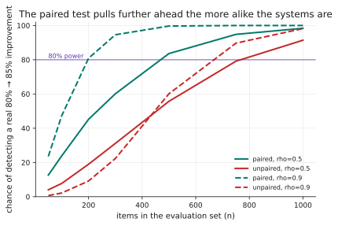
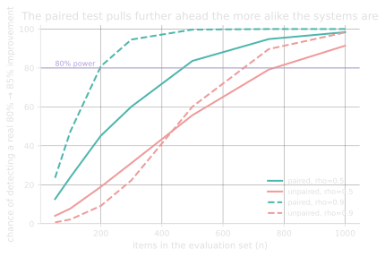

# 0.3 · Why your evaluation habits break

## A · Why this matters

This is the lesson in which your existing skills are worth the most and the
surrounding field is weakest. A large fraction of published LLM comparisons
would not survive a first-year statistics seminar, and the reason is not
ignorance so much as economics: evaluation items are expensive to produce and
label, so sample sizes stay small, and nobody enjoys being told that the
improvement they have just spent a fortnight building is indistinguishable from
noise.

Two measured numbers set the stakes for everything that follows. A success rate
observed on fifty items carries a ninety-five per cent interval of roughly
**±10.9 <!-- computed: eval_power.halfwidth_p80_n50 --> points**, which is
wider than almost any improvement anybody claims. And the test that most people
reach for by default, applied to a realistic comparison of two prompt variants,
detects a genuine five-point improvement only
**9.0% <!-- computed: eval_power.power_unpaired_n200_rho90 -->** of the time at
two hundred items.

Both problems are fixable with tools you already own, and the fix costs
nothing but the decision to use them.

!!! info "Terms used in this lesson"
    **Wilson interval** — a confidence interval for a proportion that behaves
    correctly at small sample sizes and near zero or one, where the textbook
    normal-approximation interval does not.

    **Power** — the probability that a test detects an effect that is genuinely
    present. A null result without a stated power is not a finding, because
    "we saw no difference" and "we could not have seen this difference" are
    the same sentence with very different meanings.

    **Paired comparison** — an analysis that exploits the fact that both
    systems were run on the *same* items, so that item-to-item variation
    cancels out of the difference.

    **Discordant pair** — an item on which the two systems disagree: one
    succeeded and the other failed. Only these carry information about which
    system is better.

    **Contamination** — the possibility that your evaluation items appeared in
    the model's training corpus, which inflates scores in a way you cannot
    detect from the outside.

## B · Mental model

**An evaluation run is a survey, not a measurement.** You are estimating a
proportion from a small sample, which brings with it the entire apparatus you
already know: intervals rather than point estimates, an explicit statement of
what the study could and could not have detected, and a healthy suspicion of
any comparison whose sample size is not reported.

Holding that frame does most of the work. A survey of fifty people would never
be reported as "82% support the proposal" without a margin of error, and an
evaluation on fifty items deserves exactly the same treatment for exactly the
same reason.

There is one structural fact that makes your situation better than the survey
analogy suggests, and almost nobody uses it. **You run both systems on the same
items**, so every item yields a matched pair, and the comparison is therefore
*paired* by construction. Pairing removes item-to-item variation from the
comparison entirely, and since item difficulty is usually the largest source of
variance in an evaluation set, that removal is worth a great deal. §G measures
how much.

??? question "Why is an LLM evaluation naturally paired, when an A/B test on live traffic is not?"
    In a live A/B test each user sees one variant, so the two groups contain
    different people and the analysis has to account for the possibility that
    the groups differ. In an offline evaluation you hold a fixed item set and
    run every variant over all of it, so each item produces one observation
    per system and those observations are matched. You are handed the stronger
    experimental design for free, and analysing it as though you had two
    independent samples throws that advantage away.

## C · Mechanism

**Intervals.** For a proportion, use the Wilson score interval rather than the
textbook normal approximation. The normal interval misbehaves in precisely the
region evaluation lives in — small `n`, rates near zero or one — and its
failure mode is memorable: at ten successes out of ten it reports the interval
`[1.0, 1.0]`, claiming perfect performance with complete certainty on the
strength of ten observations. Wilson gives roughly `[0.72, 1.0]` for the same
data, which is the honest answer.

**Power.** Power is the probability that your test detects an effect that is
really there, and it depends on the effect size, the sample size and the test
you chose. Reporting a null result without stating the power is reporting
nothing at all, because the reader cannot distinguish "there is no effect" from
"this study could not have found one". The remedy is a single extra sentence
naming the smallest difference the run could have detected.

**Pairing.** With matched items, the informative quantity is not each system's
overall score but the set of items on which they *disagree*. McNemar's test
uses only those discordant pairs, and the reasoning is worth internalising: an
item both systems got right tells you nothing about which is better, an item
both got wrong tells you nothing either, and including them in an unpaired
comparison adds their variance to your estimate while adding no signal. The
test statistic is simply the imbalance between the two kinds of disagreement,
scaled by how many disagreements there were in total.

## D · From data science to LLM systems

| Your habit | Still valid? | What changes |
|---|---|---|
| Hold out a test set | Yes — and more important | You cannot guarantee it is unseen; the training corpus is not yours to inspect |
| Cross-validation | No | There is no refit to cross-validate. Comparing *systems* replaces it |
| Report a point metric | No | Report an interval, always. The point estimate alone is not a result |
| A single scalar objective | Rarely | Quality, cost, latency and refusal rate move independently and trade against each other |
| Large test sets are cheap | No | Items may need human labels, so `n` is small because it is expensive |
| Suspicion of leakage | Yes — sharpened | Leakage is now the default assumption rather than a bug you introduced |

The contamination row deserves its own paragraph, because it inverts the
relationship you are used to having with leakage. In your previous work,
leakage was a mistake you made and could therefore fix: you found the offending
join, you rebuilt the split, and you re-ran. Here your evaluation set may sit
inside the model's training data, you cannot check whether it does, and no
amount of care on your part prevents it, because the contamination happened
before you arrived.

The correct response is not despair and it is not pretending the problem away.
It is to prefer items that could not plausibly have been memorised — items that
are recent, private, or synthetic — and then to state plainly what you have not
been able to rule out. Course IV, Module 14 makes contamination measurable
rather than merely worrying, and the corpus decision behind Capstone I was made
on exactly these grounds.

??? question "Your evaluation set has forty items because each one took twenty minutes to label. What is the largest claim it can support?"
    At eighty per cent observed, the interval runs roughly ±12 points, so the
    set supports a claim like "this system is somewhere between mediocre and
    good" and essentially no comparison at all. That is still worth having,
    because it rules out "terrible" and it is honest about the rest. The
    mistake is not the small set — small sets are often all you can afford —
    but reporting `80%` from it as though the number itself were the finding.

## E · Minimal implementation

Both tools, in full, with no dependencies beyond the standard library:

```python
def wilson(successes, n, z=1.96):
    p = successes / n
    denom = 1 + z*z/n
    centre = (p + z*z/(2*n)) / denom
    half = z * sqrt(p*(1-p)/n + z*z/(4*n*n)) / denom
    return max(0.0, centre - half), min(1.0, centre + half)


def mcnemar(a, b):
    """a, b: per-item booleans from the same items, in the same order."""
    b_only = sum(1 for x, y in zip(a, b) if y and not x)
    a_only = sum(1 for x, y in zip(a, b) if x and not y)
    n_disagree = b_only + a_only
    if n_disagree == 0:
        return 0.0, False
    stat = abs(b_only - a_only) / sqrt(n_disagree)
    return stat, stat > 1.96
```

Nine lines between them, and they are the difference between a result and an
anecdote. Notice what `mcnemar` does *not* use: neither `sum(a)` nor `sum(b)`
appears anywhere, because the totals are not what carries the information. Two
systems can score identically overall and still disagree on a fifth of the
items, and that situation is a real and interesting finding rather than a null
one — it means the systems are good at different things, which is an argument
for looking at *which* items each one wins rather than for picking a winner.

## F · Production practice

An evaluation harness worth having records, per item and per run: the item
identifier, the system version, the raw output, the score, and who or what
produced that score. The per-item outputs are the part people economise on and
the part that matters most, because they are what makes a paired analysis
possible later; a harness that stores only aggregates has discarded the
experimental design before anyone has had a chance to use it.

Report four numbers rather than one: the point estimate, the interval, the
sample size, and the smallest difference the run could have detected. The last
of those is the one that stops a null result being misread, and it is also the
one that makes the cost of a larger evaluation set arguable rather than a
matter of taste.

That fourth number is easier to produce than its absence suggests. You do not
need a closed form: simulate the comparison you are about to run at a range of
effect sizes, count how often your chosen test would fire, and report the
smallest effect it catches eighty per cent of the time. That is exactly what
`experiments/eval_power.py` does below, it takes a few seconds to run, and it
turns "we need a bigger evaluation set" from an intuition into a specific
request for a specific number of additional labelled items — which is the form
in which such requests actually get approved.

## G · Experiment

```bash
python experiments/eval_power.py
```

**How precise is a rate measured on n items?** Observed eighty per cent, Wilson
ninety-five per cent interval:

| n | Interval |
|---|---|
| 20 | ±16.8 <!-- computed: eval_power.halfwidth_p80_n20 --> points |
| 50 | ±10.9 <!-- computed: eval_power.halfwidth_p80_n50 --> points |
| 100 | ±7.8 <!-- computed: eval_power.halfwidth_p80_n100 --> points |
| 200 | ±5.5 <!-- computed: eval_power.halfwidth_p80_n200 --> points |
| 1000 | ±2.5 <!-- computed: eval_power.halfwidth_p80_n1000 --> points |

The first sample size on this grid that pins a rate to within five points is
**250 <!-- computed: eval_power.n_for_5pt_interval -->**, and most published
evaluations use fewer than that.

**Can you see a real five-point improvement?** The simulation models eighty per
cent improving to eighty-five per cent on items of varying difficulty, and
varies `rho`, the fraction of items on which the change makes no difference to
the outcome at all. A small prompt edit has a high `rho`, because it leaves most
behaviour untouched; two unrelated systems have a low one.

| rho | Unpaired power at n=200 | Paired power at n=200 | Paired n for 80% power |
|---|---|---|---|
| 0.0 (unrelated systems) | 25.0% <!-- computed: eval_power.power_unpaired_n200_rho0 --> | 28.7% <!-- computed: eval_power.power_paired_n200_rho0 --> | 1000 <!-- computed: eval_power.n_paired_80pct_rho0 --> |
| 0.5 | 18.5% <!-- computed: eval_power.power_unpaired_n200_rho50 --> | 46.0% <!-- computed: eval_power.power_paired_n200_rho50 --> | 500 <!-- computed: eval_power.n_paired_80pct_rho50 --> |
| 0.9 (a small prompt edit) | 9.0% <!-- computed: eval_power.power_unpaired_n200_rho90 --> | 80.5% <!-- computed: eval_power.power_paired_n200_rho90 --> | 200 <!-- computed: eval_power.n_paired_80pct_rho90 --> |

The last row rewards a second reading. When two variants are very similar —
which is the normal case, because you changed one instruction rather than
building a new system — the unpaired test finds a real improvement nine per
cent of the time while the paired test finds it eighty per cent of the time, on
*identical data*. That gap is not a modelling artefact; it is the information
that pairing recovers and that an unpaired analysis discards by construction.

The table gives four points of a picture whose whole shape is worth seeing,
because the divergence between the tests is not constant — it *grows* with the
similarity of the systems being compared:

<figure class="llm-fig" markdown>
{.fig-light}
{.fig-dark}
<figcaption markdown>Detecting a real 80% → 85% improvement, as a function of evaluation-set size. Dashed lines are rho = 0.9, the small-prompt-edit case. Rendered by `tools/figures.py` from the same simulation the table quotes, so the figure cannot disagree with it.</figcaption>
</figure>

Read the dashed pair against the solid pair and the counterintuitive half of
the lesson becomes visible: making the two systems *more* alike pushes the
paired curve up and the unpaired curve down simultaneously, so the design that
feels like a harder measurement problem is actually the easier one — provided
you analyse it as the paired data it is.

**And the same two tests with no real difference at all**, where each should
fire about five per cent of the time:

| rho | Unpaired false alarms | Paired false alarms |
|---|---|---|
| 0.0 | 3.8% <!-- computed: eval_power.false_alarm_unpaired_rho0 --> | 5.0% <!-- computed: eval_power.false_alarm_paired_rho0 --> |
| 0.5 | 0.5% <!-- computed: eval_power.false_alarm_unpaired_rho50 --> | 5.1% <!-- computed: eval_power.false_alarm_paired_rho50 --> |
| 0.9 | 0.0% <!-- computed: eval_power.false_alarm_unpaired_rho90 --> | 4.8% <!-- computed: eval_power.false_alarm_paired_rho90 --> |

The unpaired test is therefore not merely weaker but **miscalibrated** on
correlated data, drifting from 3.8% down to essentially zero as the two systems
become more alike. It would be a mistake to read that as caution. A test whose
rejection rate collapses towards zero has stopped saying anything in either
direction, and a gate that never fires is indistinguishable from a system that
never changes.

??? question "Your unpaired test says p = 0.31 on a comparison of two prompt variants at n = 200. What is the honest write-up?"
    Not "no significant difference". Something closer to: "with two hundred
    items and an unpaired test, this comparison could detect a five-point
    improvement roughly nine per cent of the time, so it is uninformative;
    re-analysed as the paired data it actually is, it has about eighty per cent
    power, and here is that result." The first version invites the reader to
    conclude the change did nothing, which the study cannot support. Only the
    second tells them whether you could have known either way.

## H · Failure modes and cost traps

**Reporting a point estimate with no interval.** The most common error and the
easiest to fix. `82%` is not a result; `82% (95% CI 76–87, n = 200)` is, and
the second version takes no longer to write.

**Treating a null result as evidence of absence** without stating the power.
The two claims differ enormously and the write-up usually conflates them.

**Using an unpaired test on paired data.** This costs you most of your ability
to detect exactly the improvements you are most likely to be making, and — per
§G — it also miscalibrates the test rather than merely weakening it.

**Re-using the same evaluation set until it passes.** Every look at a set costs
a little of its independence, and after enough looks the set has stopped
measuring quality and started measuring how many times you have looked at it.

**Comparing across model versions.** Lesson 0.1's problem, repeated here
because it invalidates the statistics no matter how carefully they are done.

**Trusting an `n` you did not choose.** A benchmark with a hundred and fifty
items carries an eight-point interval whatever its reputation, and reputation
does not narrow intervals.

??? question "Two systems score identically overall, and disagree on 40 of 200 items. Is there anything to report?"
    Yes, and it is invisible in the aggregate. Equal scores with substantial
    disagreement means the two systems are good at different things, which is
    an argument for examining which items each one wins and sometimes for
    routing between them rather than choosing. McNemar correctly reports no
    evidence that either is better *overall*, and that is a narrower claim than
    "the systems are equivalent" — "same score" and "same behaviour" are
    different assertions, and only one of them was tested.

**My own mistake, kept here on purpose.** The first version of the simulation
behind §G gave both systems a shared Gaussian shift in success probability and
clipped the result to the unit interval. Clipping quietly collapses the two
probabilities together near the ceiling, so a nominal five-point gap was worth
considerably less than five points and every power figure came out too low. The
second version fixed the effect size and still showed pairing buying almost
nothing, because it drew the two systems' outcomes independently given the
item, which makes them barely correlated. Real variants are not independent:
change one instruction and the system behaves identically on most items. Only
after adding an explicit agreement parameter did the numbers above appear.
**Two modelling errors in succession, both of which produced entirely plausible
tables.** When a simulation is the evidence, the generative model is the claim,
and it has to be argued for rather than assumed.

## I · Graded practice

<code-exercise src="tr-l3-wilson"></code-exercise>

<code-exercise src="tr-l3-mcnemar"></code-exercise>

<quiz-bank src="tr-l3"></quiz-bank>

## J · Annotated references

- **Brown, Cai & DasGupta (2001), *Interval Estimation for a Binomial
  Proportion*.** Why the textbook interval is bad and what to use instead. The
  chaotic coverage plots are worth the download by themselves.
- **Dror et al. (2018), *The Hitchhiker's Guide to Testing Statistical
  Significance in NLP*.** Written for this audience and this problem, and
  short enough to read in one sitting.
- **Cohen (1988), *Statistical Power Analysis for the Behavioral Sciences*.**
  Old, and still the reference for the question "could I have detected it".
- **Bouthillier et al. (2021), *Accounting for Variance in Machine Learning
  Benchmarks*.** On how much of a reported improvement is seed noise, with an
  answer that should make you uncomfortable.

## K · Extension

**Re-analyse somebody else's published comparison.** Find a model or prompt
comparison that states its sample size — a paper, a blog post, a vendor page —
and compute the Wilson interval for each reported rate. Check whether the
intervals overlap, and then compute the power that comparison had against the
effect it claims to have found.

If the write-up does not report `n` at all, that is itself the finding: the
result cannot be checked, and saying so publicly is a legitimate and useful
conclusion rather than a failure to complete the exercise.
