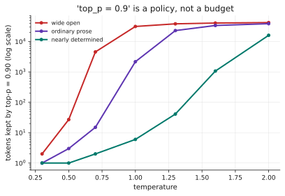
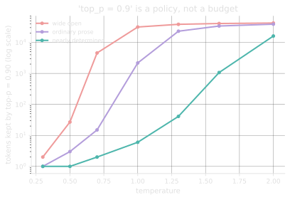

# 1.2 · Sampling: temperature, top-k, top-p

## A · Why this matters

The model does not choose a token. It produces a score for every token in the
vocabulary, and a small piece of ordinary code — which you configure, and
which is not part of the model — turns those scores into a choice.

That code has three or four knobs, they interact, their order of application
is not standardised across implementations, and the most common one does not
mean what its name suggests. `top_p=0.9` sounds like a fixed budget. Measured
on the same setting, it keeps
6 <!-- computed: sampling_shape.nucleus_p90_a20 --> tokens when the model is
confident and 31,394 <!-- computed: sampling_shape.nucleus_p90_a08 --> when it
is not.

You are also about to hear "set temperature to zero for reproducibility". At
temperature 0.3 the most likely token is chosen
92.7% <!-- computed: sampling_shape.argmax_rate_t03_pct --> of the time, which
means roughly one generation in fourteen differs — and that is *before* the
floating-point nondeterminism from [lesson 0.1](../00-transition/01-what-changes.md).

Two practical consequences follow, and both cost money rather than merely
causing confusion. The first is that a configuration copied from a blog post
is a configuration nobody measured on your task, and since these knobs trade
diversity against reliability in a direction that depends entirely on what you
are doing, the default that suits open-ended drafting is close to the worst
available choice for extraction. The second is that reproducibility claims
made on the basis of a low temperature will not survive contact with a
sequence of any length, for reasons §G measures rather than asserts.

!!! info "Terms used in this lesson"
    **Logits** — the raw, unnormalised scores the model produces for every
    token in its vocabulary at a given position. Almost all of them are
    negative, which matters more than it sounds like it should.

    **Softmax** — the function turning logits into probabilities that sum to
    one, with a temperature parameter controlling how sharply the mass
    concentrates on the highest-scoring tokens.

    **Nucleus** — the set of tokens that top-p sampling keeps: the shortest
    list of highest-probability tokens whose combined probability reaches `p`.

    **Greedy decoding** — always taking the single highest-scoring token,
    which is what temperature zero is defined to mean.

## B · Mental model

**The model proposes; the sampler disposes.**

Everything the model knows arrives as one vector of logits per position. The
sampler is a filter-then-draw pipeline over that vector:

```
logits → [temperature] → [top-k] → [top-p] → [penalties] → renormalise → draw
```

Two consequences worth holding onto. The sampler is *yours* — it is the one
part of inference you fully control, and it is ordinary code you can read.
And every knob is a way of **throwing away part of the distribution**; none of
them adds information, so every one of them trades diversity for reliability
in a direction you have to choose deliberately.

??? question "If sampling only ever discards options, why not always take the single most likely token?"
    Because the most likely token at each step does not produce the most
    likely sequence, and greedy decoding is famously prone to loops and flat,
    hedging text. It is also, for many tasks, exactly right — extraction,
    classification and structured output usually want it. The knobs exist
    because "creative" and "correct" want opposite settings, not because
    higher temperature is better.

## C · Mechanism

**Softmax with temperature.** Divide the logits by `T`, then normalise:

$$
p_i = \frac{e^{z_i / T}}{\sum_j e^{z_j / T}}
$$

Values of `T` below one sharpen the distribution by pushing mass towards the
already-likely tokens, values above one flatten it by pulling mass out towards
the tail, and `T = 1` leaves the model's own distribution alone. A temperature
of exactly zero is not a temperature at all, since the expression divides by
it, so every implementation special-cases the value to mean "take the argmax"
and you should expect nothing else from it.

The maximum logit must be subtracted before exponentiating, because `exp` of a
few hundred overflows to infinity and the subsequent division of infinity by
infinity yields `nan` — silently, and only for inputs whose logits are large,
which is to say for realistic ones rather than for the small examples a test
suite usually contains.

**Top-k** keeps the `k` highest-scoring tokens, discards everything else and
renormalises what remains, which gives a fixed candidate budget regardless of
how confident the model happens to be at that position. That fixedness is
simultaneously its weakness and its main attraction, since it makes the
behaviour predictable at the cost of being wrong in both directions: too many
candidates where the model is certain, too few where it genuinely is not.

**Top-p**, also called nucleus sampling, instead sorts the tokens by
probability and takes the shortest prefix whose cumulative probability reaches
`p`, so the number of candidates is chosen by the shape of the distribution
rather than fixed in advance. The subtlety that catches most implementations is
that the token which carries the cumulative sum *across* the threshold belongs
inside the nucleus, because otherwise a confident position — where the single
top token already exceeds `p` — leaves an empty set with nothing to sample
from at all.

**Repetition penalty** divides the logit of an already-seen token by a factor
greater than one, with the intention of discouraging the model from repeating
itself, and this is where the field's most famous sampling bug lives. Almost
every logit in a real distribution is negative, and dividing a negative number
by 1.2 moves it *towards* zero and therefore makes the token **more** likely,
so the parameter does the opposite of its name for nearly every token it
touches. The correct form multiplies when the score is negative and divides
when it is positive, which moves the logit away from zero in both cases and is
what "penalty" was supposed to mean.

??? question "Top-k and top-p both discard tokens. Why is top-p usually preferred?"
    Because the right number of candidates is not a constant. At a position
    where the model is nearly certain, top-k=50 forces 49 bad options into
    the pool; where it is genuinely uncertain, top-k=50 cuts off plausible
    continuations. Top-p chooses the count from the distribution's own shape.
    The cost of that adaptivity is that you can no longer say how many
    candidates there will be — see §G.

## D · From data science to LLM systems

You have met all of this before under other names.

| You know it as | Here |
|---|---|
| Softmax over class scores | Softmax over 50,000 "classes", one per token |
| Temperature scaling for calibration | The same operation, used to control diversity rather than to fix calibration |
| Top-k retrieval | Top-k token filtering — identical idea, different object |
| Truncating a long-tailed distribution | Top-p, chosen by mass rather than by count |
| `random_state=42` | `seed`, where offered — and it is not sufficient here |

The habit worth carrying over intact is your scepticism about calibration. You
already know that a classifier's output probabilities are not automatically
meaningful, that temperature scaling is one of the standard remedies, and that
a confidently wrong prediction is a specific and diagnosable failure rather
than bad luck. All of that applies here, with one adjustment: temperature is
being used to control *diversity* rather than to repair calibration, so
lowering it makes the model more consistent without making it any better
calibrated, and a low-temperature system that is confidently wrong will now be
confidently wrong in the same way every time.

The habit that fails is `random_state=42`. In scikit-learn, fixing the seed
fixes the output, because the seed is the only source of randomness in the
computation. Here a provider-side seed fixes the sampler's draws and leaves
untouched the batching, the floating-point ordering and the model version, so
it delivers markedly less determinism than the parameter name suggests.
Reproducibility comes from the cohort key of
[lesson 0.1](../00-transition/01-what-changes.md), which records what the
run actually depended on, rather than from a seed that pins one of four
sources of variation.

## E · Minimal implementation

The whole sampler:

```python
def softmax(logits, temperature=1.0):
    z = logits / temperature
    z = z - z.max()                       # or exp() overflows to inf, then nan
    e = np.exp(z)
    return e / e.sum()


def top_p_filter(probs, p):
    order = np.argsort(probs)[::-1]
    cum = np.cumsum(probs[order])
    keep = order[: int(np.searchsorted(cum, p) + 1)]   # +1 keeps the crosser
    out = np.zeros_like(probs)
    out[keep] = probs[keep]
    return out / out.sum()


def repetition_penalty(logits, token, penalty):
    score = logits[token]
    logits[token] = score / penalty if score > 0 else score * penalty
    return logits
```

Three functions, and each one has exactly one line that is easy to get wrong.

```python
def softmax(logits, temperature=1.0):
    if temperature == 0:                      # not a temperature; means argmax
        out = np.zeros_like(logits)
        out[np.argmax(logits)] = 1.0
        return out
    z = logits / temperature
    z = z - z.max()                           # or exp() overflows to inf, then nan
    return np.exp(z) / np.exp(z).sum()


def top_p_filter(probs, p):
    order = np.argsort(probs)[::-1]
    cum = np.cumsum(probs[order])
    keep = order[: int(np.searchsorted(cum, p)) + 1]   # +1 keeps the crosser
    out = np.zeros_like(probs)
    out[keep] = probs[keep]
    return out / out.sum()


def repetition_penalty(logits, token, penalty):
    score = logits[token]
    logits[token] = score / penalty if score > 0 else score * penalty
    return logits
```

Each of those three functions contains exactly one line that is easy to get
wrong and hard to notice, which is why each of them is an exercise below. The
max-subtraction in `softmax` is mathematically a no-op that cancels out of the
ratio, and omitting it produces `nan` only for inputs with large logits — that
is, for real ones. The `+ 1` in `top_p_filter` is what keeps the token that
carries the cumulative sum across the threshold, and without it a confident
position where the top token already exceeds `p` leaves an empty set to sample
from. And the sign test in `repetition_penalty` is the difference between a
penalty and a reward, for reasons §G puts a number on.

## F · Production practice

What providers expose, and what to do with it:

- **`temperature`** — the main diversity knob. For extraction, classification
  and structured output, use 0. For anything where you want variety, start at
  0.7 and *measure*, with lesson 0.3's tools, rather than tuning by vibe.
- **`top_p`** — usually leave at 1.0 if you are already setting temperature.
  Setting both is not wrong but the interaction is hard to reason about, and
  §G shows why.
- **`top_k`** — often unavailable. Predictable where offered.
- **`seed`** — best-effort. Record it; do not rely on it.
- **`logprobs`** — the most underused parameter in the list. Returning the
  chosen tokens' log-probabilities gives you a confidence signal for free,
  which is the cheapest abstention mechanism available (Module 4 uses it).
- **`stop` sequences and `max_tokens`** — truncation controls that operate on
  the *output* side. A response cut off by `max_tokens` is a truncated
  response, not a short one, and the finish reason tells you which.

Two further parameters deserve more attention than they usually get. The first
is `logprobs`, which asks the provider to return the log-probability of each
chosen token and is the single most underused option in the list: it costs
nothing extra, and the distribution of top log-probabilities across a response
tells you where the model was confident and where it was guessing, which is the
raw material for every abstention mechanism this curriculum builds later. The
second is the pair of `stop` sequences and `max_tokens`, which operate on the
output rather than the input and therefore interact with the finish reason
covered in [1.4](04-api-contract.md) — a response cut off at `max_tokens` is
truncated rather than short, and only the finish reason distinguishes the two.

As a starting configuration rather than a recommendation: temperature zero for
extraction, classification and anything with a schema; temperature around 0.7
with `top_p` left at 1.0 for open-ended generation; and, in both cases, a
measurement on your own data before the value is written down anywhere
permanent. Setting both temperature and `top_p` is not wrong, and it does make
the resulting behaviour considerably harder to reason about, for reasons the
next section measures.

## G · Experiment

```bash
python experiments/sampling_shape.py
```

The distribution these numbers come from is synthetic — Zipfian, with an
exponent that stands in for how confident the model is — and it is described
in the script's docstring. The point of running it across three exponents is
that every conclusion here *depends* on that confidence, which is the finding.

| Context | Top-1 prob | Entropy | Nucleus at top-p 0.90 |
|---|---|---|---|
| Wide open (α=0.8) | 2.56% <!-- computed: sampling_shape.top1_a08_pct --> | 13.51 <!-- computed: sampling_shape.entropy_a08_bits --> bits | 31,394 <!-- computed: sampling_shape.nucleus_p90_a08 --> tokens |
| Ordinary prose (α=1.2) | 19.93% <!-- computed: sampling_shape.top1_a12_pct --> | 7.80 <!-- computed: sampling_shape.entropy_a12_bits --> bits | 2,171 <!-- computed: sampling_shape.nucleus_p90_a12 --> tokens |
| Nearly determined (α=2.0) | 60.79% <!-- computed: sampling_shape.top1_a20_pct --> | 2.36 <!-- computed: sampling_shape.entropy_a20_bits --> bits | 6 <!-- computed: sampling_shape.nucleus_p90_a20 --> tokens |

**`top_p` is not a budget, it is a policy.** The same setting admits six
candidates or thirty thousand depending on the position in the text. That is
the intended behaviour and it is why nucleus sampling generally beats top-k —
but it means you cannot reason about it as "roughly N options".

<figure class="llm-fig" markdown>
{.fig-light}
{.fig-dark}
<figcaption markdown>The size of the nucleus at a fixed `top_p = 0.90`, as temperature varies. The vertical axis is logarithmic because the count spans four orders of magnitude, which is the finding rather than a plotting convenience.</figcaption>
</figure>

**Temperature moves the nucleus more than top-p does.** On the ordinary-prose
distribution, top-p 0.90 keeps
3 <!-- computed: sampling_shape.nucleus_p90_t05_a12 --> tokens at `T=0.5` and
31,394 <!-- computed: sampling_shape.nucleus_p90_t15_a12 --> at `T=1.5`. If
you are setting both, temperature is doing nearly all of the work.

**Order of operations is not a detail.** At `T=0.7`, top-p 0.90, ordinary
prose: applying temperature first leaves a nucleus of
15 <!-- computed: sampling_shape.order_nucleus_temp_first_a12 --> tokens;
applying top-p first leaves
2,171 <!-- computed: sampling_shape.order_nucleus_topp_first_a12 -->. The two
resulting distributions have a total-variation distance of
0.095 <!-- computed: sampling_shape.order_tv_distance_a12 -->. Implementations
differ on this order, so the same two parameters do not mean the same thing
everywhere.

**The repetition-penalty sign bug, measured.** A penalty of 1.2 applied to a
token whose logit is -9.07 <!-- computed: sampling_shape.penalty_logit_value -->:

| | Probability |
|---|---|
| Before the penalty | 114.7 <!-- computed: sampling_shape.penalty_base_prob_ppm --> ppm |
| Sign-aware penalty | 18.7 <!-- computed: sampling_shape.penalty_correct_prob_ppm --> ppm |
| Divide unconditionally | 520.3 <!-- computed: sampling_shape.penalty_buggy_prob_ppm --> ppm |

The buggy form makes the penalised token
**4.53× <!-- computed: sampling_shape.penalty_buggy_ratio --> more likely**.
Since most logits are negative, this is not an edge case — it is the normal
case, and a "repetition penalty" implemented this way is a repetition
*encouragement* for almost every token it touches.

**Low temperature is not determinism.**

| Temperature | Argmax chosen |
|---|---|
| 0.1 | 100.0% <!-- computed: sampling_shape.argmax_rate_t01_pct --> |
| 0.3 | 92.7% <!-- computed: sampling_shape.argmax_rate_t03_pct --> |
| 0.7 | 49.6% <!-- computed: sampling_shape.argmax_rate_t07_pct --> |
| 1.0 | 19.8% <!-- computed: sampling_shape.argmax_rate_t10_pct --> |

Per *token*. A 200-token response at `T=0.3` will almost certainly diverge
somewhere, because it only takes one position.

??? question "At T=0.3, 92.7% of tokens are the argmax. What fraction of 200-token responses are identical to the greedy one?"
    Roughly 0.927²⁰⁰, which is about 3 × 10⁻⁷ — effectively never. Per-token
    agreement is a badly misleading summary of sequence-level agreement, and
    "low temperature is basically deterministic" comes from looking at the
    per-token number.

??? question "Two libraries both accept temperature=0.7 and top_p=0.9 and produce noticeably different text. Name the likely cause before blaming the model."
    The order the two filters are applied in. §G measures a total-variation
    distance of about 0.095 between the two orders on ordinary prose, and a
    nucleus differing by two orders of magnitude. Nothing about the model has
    changed.

## H · Failure modes and cost traps

**Forgetting to subtract the max before `exp`.** Overflows to `inf`, then
`nan`, then a crash or silent garbage — and only for inputs with large logits,
so it passes every small test.

**Excluding the token that crosses the top-p threshold.** If the top token's
probability already exceeds `p`, a strict `cumsum < p` keeps *nothing* and you
sample from an empty set. It is a one-character difference and it fails only
on confident positions.

**Setting temperature and top-p together without measuring.** They interact,
their order is implementation-defined, and temperature dominates.

**Treating `seed` as reproducibility.** It fixes the sampler's draws, not the
batch composition, the model version, or floating-point ordering.

**Reporting per-token agreement as if it were sequence agreement.** They
differ by two hundred powers.

**The repetition penalty sign bug.** Measured above. Check the implementation
you are using rather than assuming.

**Using temperature to fix a prompt problem.** Lower temperature makes a wrong
answer more consistent, not more right.

## I · Graded practice

<code-exercise src="tok-l2-softmax"></code-exercise>

<code-exercise src="tok-l2-topp"></code-exercise>

<code-exercise src="tok-l2-penalty"></code-exercise>

<quiz-bank src="tok-l2"></quiz-bank>

## J · Annotated references

- **Holtzman et al. (2019), *The Curious Case of Neural Text Degeneration*.**
  The paper that introduced nucleus sampling, and the clearest statement of
  why maximum-likelihood decoding produces bad text.
- **Fan, Lewis & Dauphin (2018), *Hierarchical Neural Story Generation*.**
  Where top-k sampling comes from.
- **Keskar et al. (2019), *CTRL*.** The origin of the repetition penalty,
  including the sign-aware form that later implementations dropped.
- **The `transformers` logits-processor source.** Short, readable, and the
  fastest way to see what order a given stack applies things in — which §G
  shows you cannot assume.

## K · Extension

**Find out what your provider actually does.** Send the same prompt twenty
times at `temperature=0` and count distinct outputs; then at 0.3, then 0.7.
You now have the per-token and per-response divergence rates for a real system
rather than a simulated one, which is the number lesson 0.3 needs before you
can compare anything.

If `logprobs` is available, record them too. The distribution of the top
logprob across positions tells you where the model was confident and where it
was guessing, and it is the raw material for every abstention mechanism in
Module 4.
