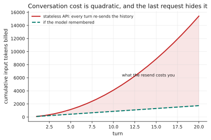
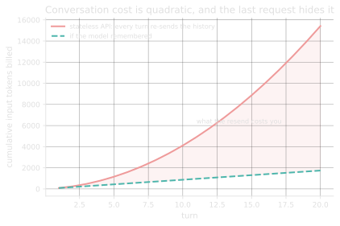

# 1.3 · Context windows and chat templates

## A · Why this matters

[Lesson 1.1's extension](01-bpe.md) ended on a puzzle: you count the tokens in
your prompt, the provider reports a larger number, and the gap is stable. This
lesson is the answer, and the answer has a bill attached.

You are not sending text. You are sending a **chat template** — your messages
wrapped in role markers the model was trained to expect — and then, because
the API is stateless, you are sending the entire conversation again on every
turn. Measured on an eight-message conversation:
115 <!-- computed: chat_overhead.final_overhead_tokens --> of the final
prompt's 303 <!-- computed: chat_overhead.final_prompt_tokens --> tokens are
wrapper, and the conversation as a whole bills
769 <!-- computed: chat_overhead.conversation_total_tokens --> input tokens —
2.54× <!-- computed: chat_overhead.amplification_vs_final --> the size of the
largest single request.

At twenty turns that ratio is
8.9× <!-- computed: chat_overhead.projected_amplification -->.

The reason this matters beyond tidy accounting is that both quantities are
constraints rather than statistics. The context window is a hard ceiling that a
request either fits inside or does not, so an underestimate does not degrade
gracefully but produces a rejected request or a silently truncated one; and the
billing is charged per request forever, so a factor you failed to account for
compounds across every conversation your product will ever hold.

!!! info "Terms used in this lesson"
    **Chat template** — the string format a model was trained to expect,
    wrapping each message in role markers. It is applied before tokenization,
    so its markers are tokens you pay for.

    **Generation prompt** — the trailing fragment that opens the assistant's
    turn, telling the model whose turn it is. It appears once per request.

    **Context window** — the maximum number of tokens a request may contain,
    counting the prompt and the generated answer *together*.

    **Truncation policy** — the rule deciding what to drop when the budget is
    exceeded. If you do not write one, your library has written one for you.

## B · Mental model

**The context window is a budget with four claimants and no overdraft.**

```
| system | conversation history | retrieved context | ← reserved for output → |
```

All four claimants compete for one number, and nothing in the API arbitrates
between them on your behalf, so if you do not write the policy yourself then
the policy is whatever your library happens to do — which is usually either
"truncate the oldest thing" or "raise", and you will discover which one only
when a conversation first exceeds the budget in production.

It is also worth being precise that the window is not memory in any sense a
programmer would recognise, because it is re-uploaded in full on every single
request. A conversation *feels* stateful to the person having it, and is billed
exactly as though you had pasted the entire transcript into a fresh request
each time, which is precisely what your client did.

??? question "The provider reports 303 prompt tokens; you counted 188. Where did 115 tokens come from, and is it a bug?"
    The chat template. Every message is wrapped in role markers, and the
    request ends with a generation prompt telling the model whose turn it is.
    It is not a bug and it is not overhead you can decline — the model was
    trained on that format, and sending raw text instead makes the input
    stranger, not cheaper. It is, however, something to count.

## C · Mechanism

**The chat template.** A string format, applied to your list of messages
before tokenization. Something like:

```
<|im_start|>system
You are a careful assistant.<|im_end|>
<|im_start|>user
Where is my shipment?<|im_end|>
<|im_start|>assistant
```

Three consequences follow from that shape, and all three are billed. The role
markers are ordinary tokens rather than metadata, so they occupy budget and
appear on the invoice; the **trailing generation prompt** that opens the
assistant's turn is part of every request rather than of every conversation, so
its cost is paid once per call; and the template is specific to the model,
which means that rendering the same messages with the wrong template produces
input unlike anything that model saw during training.

**The stateless resend.** Request *i* contains messages 1..*i*. If each
exchange adds roughly `m` tokens, request *i* costs about `s + (i-1)·m`, and
the total over `N` requests is

$$
\sum_{i=1}^{N} \bigl(s + (i-1)m\bigr) = Ns + m\frac{N(N-1)}{2}
$$

which is quadratic in `N` rather than linear, so a conversation twice as long
costs appreciably more than twice as much. That is the single most
consequential sentence in this lesson, because almost every mental model of
conversational cost is implicitly linear.

**Truncation policy.** When the budget is exceeded, something must go. The
options, roughly in order of how much work they are:

| Policy | Keeps | Loses |
|---|---|---|
| Drop oldest | Recency | The original instruction, if you are careless |
| Drop oldest, pin system | Recency and instructions | Early context |
| Summarise and replace | Gist of early turns | Detail, and you pay for the summarisation |
| Middle-out | Both ends | The middle, which is where the least is usually lost |

The one policy that is always wrong is silent truncation by character count,
for the reasons in [1.1 §H](01-bpe.md).

??? question "Summarising old turns replaces many tokens with few. Why is it not obviously the best policy?"
    It costs a model call to produce the summary, and that call is billed and
    adds latency — so it pays off only once the history is long enough for the
    saving to exceed it. It is also lossy in a way you cannot audit later: the
    detail that turns out to matter is exactly the detail a summariser drops,
    and there is no error when it does. Worth doing for long-running
    assistants; rarely worth doing at turn four.

## D · From data science to LLM systems

This is a serialization problem, and you have solved a hundred of them.

| You know | Here |
|---|---|
| A record has a schema; serialize it before sending | Messages have a template; render it before counting |
| Payload size limits | Context window, in tokens |
| Pagination for oversized results | Truncation policy, which you must write |
| Idempotent stateless requests | Stateless requests that re-send the entire history |

The analogy breaks in one place, and it is the important place. **A malformed
serialization normally raises.** Send JSON where the server wants XML and you
get a 400. Send a badly rendered chat template and you get a perfectly
plausible answer of slightly worse quality, with no error anywhere. The
template is a format the model was *trained* on rather than one it *validates*
— so it degrades instead of failing, and it degrades quietly.

That is the same failure shape as
[0.2's seven stages](../00-transition/02-anatomy.md): nothing raises.

??? question "Your conversation feels stateful — the model refers to what you said five turns ago. What is actually maintaining that state?"
    Your client, by re-sending it. The API is stateless; the model has no
    memory between requests. That is why the cost is quadratic and why
    "remembering" is a feature you pay for by the token on every turn rather
    than a property of the model.

The consequence of that asymmetry is worth stating as a working rule: **in this
stack a format error is a quality regression rather than an exception**, so it
has to be caught by measurement rather than by error handling. You cannot wrap
prompt rendering in a `try` block and conclude from the absence of an exception
that the rendering was correct, because there is no code path in which a
mis-rendered template raises anything at all. What you can do instead is
reconcile your local token count against the provider's reported count on every
request during development, which converts an invisible formatting bug into a
visible arithmetic discrepancy, and that reconciliation is probably the most
useful five lines you will add to a client this month.

## E · Minimal implementation

Counting is the whole job, and it has three parts people forget:

```python
TEMPLATE_OVERHEAD = 4        # role markers around each message
GENERATION_PROMPT = 3        # the assistant's opening, on every request

def prompt_tokens(messages):
    return sum(m["tokens"] + TEMPLATE_OVERHEAD for m in messages) + GENERATION_PROMPT


def fits(messages, context_limit, reserved_output):
    return prompt_tokens(messages) + reserved_output <= context_limit
```

And a trimming policy with its invariants stated:

```python
def trim(messages, budget):
    """Keep the system message, drop the oldest exchanges, keep pairs intact."""
```

Writing those invariants down is most of the work. A trimmer that drops a user
message and keeps the assistant's reply to it produces a transcript in which
the model appears to have answered a question nobody asked.

The second half of the job is deciding what to drop when the total does not
fit, and here the invariants matter considerably more than the algorithm that
enforces them:

```python
def trim(messages, budget):
    # Keep the system message, drop the oldest exchanges, keep pairs intact.
    system = [m for m in messages[:1] if m["role"] == "system"]
    history = messages[len(system):]
    for i, m in enumerate(history):
        if m["role"] != "user":                 # never start on an assistant turn
            continue
        candidate = system + history[i:]
        if prompt_tokens(candidate) <= budget:
            return candidate
    raise ValueError("cannot fit the system message and the final user message")
```

Writing those invariants down is most of the work, and each exists because of a
specific failure that is otherwise invisible. A trimmer that drops the system
message produces a request which still succeeds while no longer saying what the
assistant is for, so behaviour changes with no corresponding entry in any log.
A trimmer that starts the surviving history on an assistant message presents
the model with a reply to a question it cannot see, and models will sometimes
answer the question they infer must have been asked. A trimmer that returns
*something* when nothing legitimate fits has converted an impossible request
into a plausible wrong one, which is why the final branch raises rather than
improvising an answer nobody asked for.

## F · Production practice

Use the provider's or the model's own template — `apply_chat_template` in the
`transformers` ecosystem, or whatever your SDK renders — rather than building
the string yourself. Getting it approximately right is worse than it sounds,
because it fails silently.

Count from the provider's reported `prompt_tokens` and reconcile it against
your local estimate on every request during development. A stable gap is the
template; a *growing* gap is a bug.

Always read the finish reason. A response that stopped because it hit
`max_tokens` is a truncated response, and it is indistinguishable from a
complete one by inspection — mid-sentence endings are not reliable, and JSON
truncated at `max_tokens` sometimes still parses.

Reserve output tokens explicitly. The window is shared between input and
output, and a prompt that exactly fills it leaves nowhere for an answer.

Prompt caching deserves a specific mention, because it is the one mechanism
that changes §G's arithmetic rather than merely reducing its constant. A
provider offering it will charge a reduced rate for a *stable prefix* it has
seen before, which maps precisely onto the part of a conversation you were
re-sending anyway, so the quadratic term does not vanish but its coefficient
drops substantially. Two design consequences follow directly: put the stable
material at the front so that the cacheable prefix is as long as possible, and
keep anything that varies per request — a timestamp, a request id, a randomised
greeting — out of that prefix entirely, since a single changed token
invalidates the cache for everything after it.

## G · Experiment

```bash
python experiments/chat_overhead.py
```

Counts recorded from a real tokenizer on **2026-08-09**; the conversation is
eight messages of ordinary support dialogue.

**What the wrapper costs.**

| | Tokens |
|---|---|
| Content actually written | 188 <!-- computed: chat_overhead.final_content_tokens --> |
| Chat-template wrapper | 115 <!-- computed: chat_overhead.final_overhead_tokens --> |
| **Final prompt** | **303 <!-- computed: chat_overhead.final_prompt_tokens -->** |

That is 38.0% <!-- computed: chat_overhead.overhead_share_pct --> of the
request. The measurement treats the role markers as ordinary text, because
they are not special tokens in the encoding used; that costs
13.4 <!-- computed: chat_overhead.overhead_per_message --> tokens per message.
Where the markers *are* real special tokens — which is the usual case in
production templates — the cost is around
4 <!-- computed: chat_overhead.special_token_overhead_per_message --> tokens
per message, or roughly
14.5% <!-- computed: chat_overhead.special_token_overhead_share_pct --> of the
prompt. **The size of the wrapper is negotiable; its existence is not.**

**What the resend costs.** Four requests over that conversation:

| | Tokens |
|---|---|
| Largest single prompt | 303 <!-- computed: chat_overhead.final_prompt_tokens --> |
| Total input billed | 769 <!-- computed: chat_overhead.conversation_total_tokens --> |

Projecting the measured growth of
72.0 <!-- computed: chat_overhead.per_exchange_tokens --> tokens per exchange
out to 20 <!-- computed: chat_overhead.projected_turns --> turns — a linear fit
whose worst error on the measured points is
3.2% <!-- computed: chat_overhead.fit_max_error_pct -->:

| | Tokens |
|---|---|
| Final prompt at turn 20 | 1,455 <!-- computed: chat_overhead.projected_final_prompt --> |
| Total input billed | 15,420 <!-- computed: chat_overhead.projected_total_tokens --> |
| If every turn were stateless | 1,740 <!-- computed: chat_overhead.projected_stateless_total --> |

<figure class="llm-fig" markdown>
{.fig-light}
{.fig-dark}
<figcaption markdown>Cumulative input tokens over a twenty-turn conversation, projected from the measured per-exchange growth. The curvature is the resend, and the shaded area is what it costs you.</figcaption>
</figure>

**8.9× <!-- computed: chat_overhead.projected_amplification -->.** Nobody
sizes a conversational feature by looking at the last request, and the last
request is what everybody looks at.

??? question "A product manager asks what a 20-turn support conversation costs. What is the wrong number to give them, and why is it tempting?"
    The final prompt — 1,455 tokens. It is tempting because it is the biggest
    single number you can see in the logs and it feels like an upper bound.
    The real figure is 15,420, roughly ten times larger, because every earlier
    turn was billed too. Cost per *conversation* and cost per *request* differ
    by a factor that grows with conversation length.

## H · Failure modes and cost traps

**Counting your text instead of the rendered template.** A stable
underestimate, and it is largest for conversations with many short messages —
because the wrapper is per-message, not per-token.

**Sizing a conversational feature from the last request.** Off by a factor
that grows with conversation length. Measured above at 8.9× by turn twenty.

**Dropping the system message when trimming.** The instructions vanish, the
request still succeeds, and the assistant's behaviour changes for no reason
anyone can see from the logs. Pin it.

**Trimming to an odd number of messages.** Keep exchanges intact. A transcript
that begins with an assistant reply implies a question the model can no longer
see, and it will sometimes answer the imagined one.

**Filling the window with input.** Input and output share it. Reserve for the
answer explicitly or the answer is what gets truncated.

**Ignoring the finish reason.** A `max_tokens` truncation looks exactly like a
short answer, and truncated JSON sometimes still parses — which converts a
visible failure into a silent wrong result.

**Building the template string yourself.** It is model-specific and it fails
by degrading. Use the provided renderer.

## I · Graded practice

<code-exercise src="tok-l3-count"></code-exercise>

<code-exercise src="tok-l3-trim"></code-exercise>

<quiz-bank src="tok-l3"></quiz-bank>

## J · Annotated references

- **The `transformers` chat-templating documentation.** The clearest
  explanation of why the template belongs to the model rather than to your
  code, and how Jinja templates are shipped with tokenizers.
- **Liu et al. (2023), *Lost in the Middle*.** Position within the context
  window affects whether information is used at all. Directly relevant to
  *where* in the prompt you put retrieved context — Module 3 returns to it.
- **Any provider's "prompt caching" documentation.** The direct mitigation for
  the quadratic resend: a stable prefix can be cached server-side. Read it
  with §G's arithmetic in hand, because the saving is exactly the part you
  were re-sending.

## K · Extension

**Reconcile your counts against a provider's, once.** Send a three-message
conversation and compare your local token count with the reported
`prompt_tokens`. The difference is your template overhead. Then send a
six-message version: the difference should grow by roughly the same amount per
message, and if it grows faster you have found a real bug in your rendering.

**Then price your own worst case.** Take the longest conversation your product
plausibly supports, apply §G's formula, and compare it with the per-request
number in your dashboard. That ratio is the one to bring to a planning
conversation.

**Then measure the cost of your own truncation policy.** Take a conversation
long enough to exceed your budget, apply whatever trimming your system
currently performs, and count how many tokens of genuine content were
discarded. The number matters less than the question it forces, which is
whether anybody chose that policy or whether it arrived as a library default —
and in most systems the honest answer is the second, which means the decision
about what your assistant forgets was made by somebody who had never seen your
product.

Two follow-up questions are worth asking once you have the number in front of
you. Does the policy preserve the system message under every budget, including
the smallest one your product can encounter? And does it ever produce a
transcript beginning with an assistant turn, which is the specific corruption
that makes a model answer a question nobody asked? Both are one-line checks
against the trimmer you already have, and both fail more often than people
expect.
