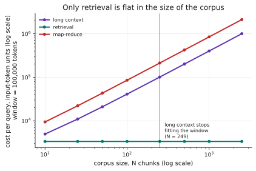
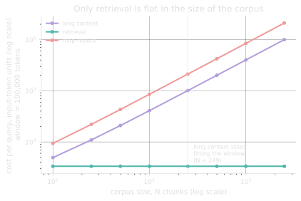

# 1.5 · Costing a design before you build it

## A · Why this matters

[Lesson 0.4](../00-transition/04-cost-and-latency.md) was about measuring a
system you already have. This one is about the cheaper skill: putting numbers
on a system that does not exist yet, in the half hour before anybody commits
to building it.

The arithmetic is trivial and almost nobody does it. Three architectures for
the same task — stuff everything into the prompt, retrieve the relevant part,
or summarise piece by piece and combine — differ by
**119.9× <!-- computed: design_costs.longctx_over_rag_n1000 -->** in cost at a
thousand chunks, and the difference is fully determined by parameters you know
before writing any code.

This lesson is a cost and latency model. **It says nothing about whether a
design works.** That distinction is the whole of §H.

The reason this half hour is worth so much is that the parameters it needs are
all knowable before anything is built, while the decision it informs becomes
progressively more expensive to reverse. Chunk size, corpus size, expected
answer length and the ratio between input and output pricing are either known
or estimable on day one, and they determine the shape of the cost curve
completely — so the analysis is available at precisely the moment it can still
change the architecture, and it is almost never performed then.

!!! info "Terms used in this lesson"
    **Long context** — putting the entire corpus into a single prompt, which
    costs one call whose input grows with the corpus.

    **Retrieval** — selecting the `k` most relevant chunks and sending only
    those, so that cost does not grow with the corpus at all.

    **Map-reduce** — summarising each chunk in its own call and combining the
    summaries in a final one, which costs `N + 1` calls.

    **Per-call overhead** — the system prompt and question, paid once per
    call, and therefore `N` times in a fan-out design.

## B · Mental model

**A design is a shape, and the shape is what scales.**

| Design | Calls | Input grows with |
|---|---|---|
| Long context | 1 | N — the whole corpus, every time |
| Retrieval | 1 | nothing — k chunks regardless of N |
| Map-reduce | N + 1 | N, **and** it re-sends the instructions N times |

Before any numbers, that table already tells you the answer at large N. The
numbers tell you where "large" starts, which is usually much sooner than
people expect.

??? question "Before reading §G: which design has the steepest cost growth in N, and why is it not the one that sends the most tokens per call?"
    Map-reduce. Long context sends more tokens in its single call, but
    map-reduce makes N calls and each one carries its own copy of the system
    prompt and the question. Per-call overhead multiplied by N is a cost term
    that does not exist in the other two designs, and it is invisible if you
    reason about "total corpus tokens".

## C · Mechanism

Four parameters, all knowable in advance: chunk size `c`, corpus size `N`,
retrieved count `k`, and the per-call overhead `s` (system prompt + question).
Output length `a` and the price ratio `r` complete the model.

$$
\begin{aligned}
\text{long context} &= (s + Nc) + ar \\
\text{retrieval} &= (s + kc) + ar \\
\text{map-reduce} &= N(s + c + \mu r) + (s + N\mu) + ar
\end{aligned}
$$

where `μ` is the length of each map call's summary. Read the third line
carefully: `Ns` is the instructions, re-sent once per chunk, and `Nμr` is the
map output, which is priced at the output rate.

**Latency has a different shape from cost.** Long context is one call whose
prefill grows with N. Map-reduce is `⌈N/P⌉` rounds of map plus one reduce, so
its latency depends on how much concurrency you have — which makes it the only
one of the three with a knob that trades money for time.

**Feasibility is a third axis.** Long context has a hard ceiling: at some N it
no longer fits the window at all, and no amount of budget changes that.
Retrieval has no such ceiling.

??? question "Map-reduce makes N + 1 calls but its largest single request is small. What limits it, then?"
    Its reduce call, which reads every summary — so it hits the ceiling at
    `N·μ` rather than `N·c`, and with 60-token summaries against 400-token
    chunks that is roughly seven times further out. It is bounded, just much
    later. The design with genuinely no ceiling is retrieval, because its
    request size does not depend on N at all.

## D · From data science to LLM systems

This is capacity planning, and you have done it under other names.

| You know | Here |
|---|---|
| Big-O of a pipeline before you write it | Token count as a function of corpus size |
| "Does this fit in memory?" | "Does this fit in the window?" |
| Batch versus streaming | One call versus N calls |
| Cost per row of a data pipeline | Cost per query of an LLM design |

The habit that transfers perfectly is refusing to build before you have
sketched the complexity. The one that needs adjusting is *which* resource is
scarce: here it is neither CPU nor memory but a per-request token budget with
a hard ceiling, and a bill that is linear in exactly the quantity you were
about to make quadratic.

There is also a genuinely new failure: the cheap design can be the wrong one,
and cost modelling cannot see it. A pipeline that runs in half the time but
returns different rows would be an obvious bug. A design that costs a hundredth
as much and retrieves the wrong chunks looks like a triumph until somebody
evaluates it.

It is worth being concrete about what "cost modelling cannot see it" means in
practice, because the failure has a recognisable shape. A retrieval design that
returns the wrong six chunks does not produce an error, an empty response or an
obviously wrong answer; it produces a fluent, confident answer drawn from
whatever the model already knew, which is exactly what the system would produce
if retrieval were working and the answer happened to be common knowledge.
Distinguishing those two situations requires the gold-evidence machinery of
Module 3 and the statistical machinery of
[lesson 0.3](../00-transition/03-evaluation-breaks.md), and no amount of
arithmetic about token counts will substitute for either.

## E · Minimal implementation

The entire model:

```python
def cost_units(design, n, c=400, s=145, k=6, a=200, mu=60, r=4.0):
    if design == "long_context":
        return (s + n * c) + a * r
    if design == "retrieval":
        return (s + min(k, n) * c) + a * r
    if design == "map_reduce":
        per_map = (s + c) + mu * r          # note: s is paid N times
        return n * per_map + (s + n * mu) + a * r
```

Ten lines, no dependencies, and it is enough to rule out an architecture
before the first commit.

Three details in those ten lines are worth naming, because each corresponds to
a mistake that is easy to make and invisible afterwards. The `min(k, n)` in the
retrieval branch handles the case where the corpus is smaller than the number
of chunks you intended to retrieve, which is common in testing and produces a
silent overestimate without it. The `s` term appears inside the `map_reduce`
multiplication rather than outside it, because the instructions are re-sent
with every map call and that `N·s` term is the single largest surprise in the
whole model. And output is multiplied by `r` wherever it appears, including the
summaries emitted by the map calls, which are output tokens priced at the
output rate even though they are consumed internally rather than shown to
anybody.

## F · Production practice

Prompt caching changes the arithmetic materially for designs with a large
stable prefix, which is long context and, for the system prompt, map-reduce.
Check whether your provider offers it before concluding that long context is
unaffordable, and read [1.3 §G](03-context-windows.md) for what the cached
part actually is.

State three numbers explicitly in whatever design document carries this model,
because each answers a question somebody will otherwise ask at a worse moment:
the cost per query at your expected corpus size, the corpus size at which the
design stops fitting the window, and the concurrency required if you are
proposing a fan-out. The third is the one most often omitted, and it is the one
that turns out to depend on a rate limit somebody else controls.

Then re-derive the whole thing once the system exists, because the parameters
drift during implementation in a consistent direction. Chunks grow as people
discover that retrieval works better with more context around each hit,
answers grow as prompts are tuned to be more thorough, and summaries grow
because a short summary loses the detail the reduce step needed. Each of those
moves the crossovers, and the model costs ten minutes to re-run.

## G · Experiment

```bash
python experiments/design_costs.py
```

Chunks of 400 <!-- computed: design_costs.chunk_tokens --> tokens,
k = 6 <!-- computed: design_costs.retrieved_k -->, output priced at
4× <!-- computed: design_costs.price_ratio --> input,
8 <!-- computed: design_costs.parallelism --> concurrent map calls. Cost is in
input-token units, per query.

| N | Long context | Retrieval | Map-reduce |
|---|---|---|---|
| 100 | 40,945 <!-- computed: design_costs.long_context_n100_cost --> / 4.2 <!-- computed: design_costs.long_context_n100_latency_s -->s | 3,345 <!-- computed: design_costs.retrieval_n100_cost --> / 2.5 <!-- computed: design_costs.retrieval_n100_latency_s -->s | 85,445 <!-- computed: design_costs.map_reduce_n100_cost --> / 14.2 <!-- computed: design_costs.map_reduce_n100_latency_s -->s |
| 1000 | 400,945 <!-- computed: design_costs.long_context_n1000_cost --> / 20.4 <!-- computed: design_costs.long_context_n1000_latency_s -->s | 3,345 <!-- computed: design_costs.retrieval_n1000_cost --> / 2.5 <!-- computed: design_costs.retrieval_n1000_latency_s -->s | 845,945 <!-- computed: design_costs.map_reduce_n1000_cost --> / 115.7 <!-- computed: design_costs.map_reduce_n1000_latency_s -->s |

<figure class="llm-fig" markdown>
{.fig-light}
{.fig-dark}
<figcaption markdown>Cost per query against corpus size, in input-token units, on logarithmic axes. Retrieval's flatness is the structural property; the vertical line is the feasibility ceiling, past which long context is not an expensive option but an unavailable one.</figcaption>
</figure>

**Retrieval is flat.** Its cost and latency do not move between N=100 and
N=1000, because k does not depend on N. That flatness is the entire argument
for retrieval, and it is a structural property rather than a tuning result.

**Long context costs 12.2× <!-- computed: design_costs.longctx_over_rag_n100 -->
retrieval at N=100 and
119.9× <!-- computed: design_costs.longctx_over_rag_n1000 --> at N=1000.** It
also stops being possible: past
249 <!-- computed: design_costs.long_context_max_chunks --> chunks it no longer
fits a window of 100,000 tokens, and the two entries in the N=1000 row above
are a design that cannot be built.

**Map-reduce is dominated on both axes here, which surprised me.** It costs
2.1× <!-- computed: design_costs.mapreduce_over_longctx_at_max_n --> what long
context does at N=1000 — the `Ns` term, paying for the instructions a thousand
times — and at 8 concurrent calls it is also *slower*, at
115.7 <!-- computed: design_costs.map_reduce_n1000_latency_s -->s against
20.4 <!-- computed: design_costs.long_context_n1000_latency_s -->s.

Its advantage is real but narrower than its reputation: it has no window
ceiling, and its latency is the only one with a concurrency knob. To match
long context's latency at N=1000 it needs
59 <!-- computed: design_costs.parallelism_needed_at_max_n --> concurrent
calls — which is a rate-limit question ([1.4](04-api-contract.md)), not a
design question, and it still costs twice as much.

??? question "Retrieval wins on every number in that table. Why is 'use retrieval' not the conclusion?"
    Because the table has no quality column. Retrieval is cheap precisely
    because it looks at 6 chunks instead of 1,000, and whether those are the
    right 6 is the entire question — one this model cannot answer and Module 3
    is about. The correct conclusion is narrower: *retrieval is the only
    design whose cost does not grow with the corpus, so if it can be made to
    work, it is the one to make work.*

??? question "Long context stops fitting past 249 chunks. Which of the three constraints — cost, latency, feasibility — should you check first when sketching a design?"
    Feasibility, because it is binary and it is free to check. A design that
    does not fit is not an expensive design, it is not a design. Cost and
    latency are then trade-offs to negotiate; the ceiling is not negotiable.

## H · Failure modes and cost traps

**Reading the cheap column as the answer.** The model has no quality axis. Any
conclusion of the form "so we should use X" needs an evaluation, not an
arithmetic sheet.

**Forgetting per-call overhead in fan-out designs.** The `Ns` term is the
single largest surprise in §G, and it is invisible if you reason in terms of
"total corpus tokens" rather than per call.

**Costing at today's N.** Every design in §G looks fine at N=10. The question
is the shape, and the shape is what you are choosing between.

**Ignoring the window ceiling until implementation.** It is the one constraint
that cannot be bought out of, and it is the cheapest to check.

**Assuming fan-out is faster.** It is faster only with concurrency you may not
have, and the concurrency you have is set by a rate limit somebody else
controls.

**Modelling once and never again.** Chunk size, summary length and answer
length all drift during a build. Re-derive when they do.

**Quoting the model's absolute numbers.** These are input-token units under a
stated latency model, not seconds and dollars from a provider. Ratios and
crossovers transfer; the absolutes do not.

**Costing the design you have rather than the design you are choosing.** The
model is most valuable applied to two or three candidate architectures side by
side, because its output is a comparison rather than an absolute, and a single
column of numbers for the option somebody has already picked answers a question
nobody was asking. Running it once per candidate takes minutes and is the only
form of the exercise that can change a decision.

**Assuming the price ratio is stable enough to hardcode.** It moves more slowly
than the absolute prices, which is why the model is expressed in terms of it,
and it does move — and because output is multiplied by `r` in every branch, a
change in the ratio shifts all three curves by different amounts and can
relocate a crossover. Keep it a parameter rather than folding it into the
constants.

**Ignoring the cost of building the retrieval index.** The model above prices a
*query*, and retrieval additionally requires embedding the corpus once and
re-embedding whatever changes. For a static corpus that is a rounding error
amortised over every query that follows, and for a corpus that turns over
frequently it can dominate — so the question worth asking early is how often
your documents change, not merely how many of them there are.

## I · Graded practice

<code-exercise src="tok-l5-cost"></code-exercise>

<code-exercise src="tok-l5-choose"></code-exercise>

<quiz-bank src="tok-l5"></quiz-bank>

This lesson closes Module 1. The module's graded artifact,
[**Mini-project 1 · the context packer**](project-tokenizer.md), is the
implementation counterpart of §C's feasibility term.

## J · Annotated references

- **Any provider's prompt-caching documentation.** The one mechanism that
  materially changes §G's arithmetic, and the reason to re-derive rather than
  copy these numbers.
- **Lewis et al. (2020), *Retrieval-Augmented Generation*.** Where the middle
  column comes from. Read for the design rather than the benchmark numbers.
- **The map-reduce chapter of any distributed-systems text.** The pattern is
  fifty years old and its cost structure — per-task overhead times number of
  tasks — is unchanged.

## K · Extension

**Cost the design you are actually considering.** Take §E's ten lines, put in
your own chunk size, corpus size and answer length, and produce three numbers:
cost per query, the N at which it stops fitting, and the concurrency you would
need if you fanned out.

Then do the part that makes it engineering rather than accounting: for the
cheapest design that is feasible, write down what you would have to measure to
know whether it works, and how many items that measurement needs. Lesson 0.3
gives you the second number, and it is usually the one that decides the
schedule.

**Finally, write down the number that would change your mind.** A cost model is
most useful when it names its own breaking point, so record the corpus size,
the chunk size or the price ratio at which your chosen design stops being the
right one. That single sentence converts the analysis from a justification of a
decision already taken into a trigger somebody can check against reality in six
months, which is the difference between a design document that ages well and
one that is quietly ignored.

If you keep only one habit from this lesson, make it that one: a design
document which states the condition under which its own conclusion expires is
doing something that almost no design document does, and it costs a single
sentence to write.
