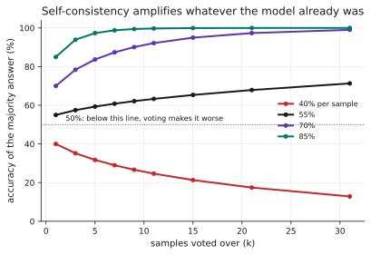
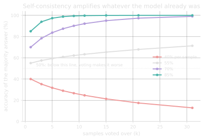

# 2.3 · Decomposition, chaining and self-consistency

## A · Why this matters

Two techniques dominate any discussion of getting harder tasks done: break the
problem into steps, and sample several answers and take the majority. Both are
recommended almost unconditionally, and both are arithmetic with preconditions
that are rarely stated and easy to check.

The preconditions are not subtle once written down. Majority voting improves
accuracy only when the model is already right more often than not, and at
per-sample accuracy of 40% a twenty-one-sample vote is
22.6 <!-- computed: self_consistency.vote_p40_k21_loss --> points **worse**
than asking once. Decomposition splits one step into several, and because
their accuracies multiply, breaking a 70% step into three requires each new
step to reach 88.8% <!-- computed: self_consistency.breakeven_n3 --> merely to
break even.

Neither of those is a reason to avoid the techniques. They are the conditions
under which the techniques pay, and this lesson is about computing them before
committing rather than discovering them afterwards.

!!! info "Terms used in this lesson"
    **Self-consistency** — sampling `k` answers at non-zero temperature and
    returning the most common one, rather than taking a single sample.

    **Chain** — a sequence of steps where each step's output feeds the next,
    so every step must be right for the result to be right.

    **Decomposition** — replacing one hard step with a chain of easier ones.

    **Condorcet's jury theorem** — the result that a majority of independent
    voters, each right with probability p, is more likely to be right than any
    one of them **if and only if p > 0.5**.

    **Sample correlation** — the degree to which repeated samples from one
    model make the *same* mistake, which is what bounds the benefit of voting.

## B · Mental model

**Voting amplifies whatever the model already is.** It does not add
information; it reduces the variance of a process whose mean is fixed, so it
pushes accuracy towards whichever side of one half the model already sits on.
Above 0.5 the majority converges towards being right, below 0.5 it converges
towards being reliably wrong, and at exactly 0.5 it does nothing at all.

**Chaining multiplies.** This is [lesson 0.2](../00-transition/02-anatomy.md)'s
serial reliability applied to reasoning rather than to infrastructure: a chain
is only as good as the product of its parts, so adding a step is a cost that
has to be paid for by the accuracy improvement it enables.

Holding both at once gives the useful frame. Decomposition and voting pull in
opposite directions on the same quantity — decomposition multiplies more
numbers below one together, voting pushes one number towards an extreme — and
a design that uses both is buying with one hand what it spends with the other.

??? question "Voting adds no information. Why does it help at all, then?"
    Because the errors are not the same on every sample. If the model has a
    60% chance of the right answer and its 40% of failures scatter across
    several different wrong answers, then the right answer is the single most
    common outcome even though it is a minority of the probability mass in
    aggregate. Voting exploits the *dispersion* of the errors, which is also
    exactly why correlated errors defeat it: if the model fails the same way
    every time, the wrong answer wins the vote as reliably as the right one
    would have.

## C · Mechanism

**Majority voting, exactly.** With `k` independent samples each correct with
probability `p`, the majority is correct when more than half are:

$$
P(\text{majority correct}) = \sum_{i > k/2}^{k} \binom{k}{i} p^{i} (1-p)^{k-i}
$$

This is a closed form rather than something to simulate, and evaluating it for
your own `p` takes one line. Odd `k` avoids ties, which is why every practical
implementation uses one.

**The precondition.** The expression above is increasing in `k` when `p > 0.5`
and *decreasing* when `p < 0.5`. Condorcet's theorem is usually quoted for the
first half only, and the second half is the one that costs money: if your task
sits below the halfway mark, every additional sample makes the result worse
while charging you for the privilege.

**Correlation.** Repeated samples from one model are not independent jurors,
because a model that is confidently wrong is confidently wrong every time.
Model this with a parameter `rho` — the probability that the model is committed
to a single answer, so all `k` samples agree — giving

$$
P(\text{correct}) = \rho\,p + (1-\rho)\sum_{i > k/2}^{k} \binom{k}{i} p^{i} (1-p)^{k-i}
$$

The first term is the fraction of cases where voting is powerless by
construction. As `rho` rises the achievable benefit shrinks towards zero while
the cost stays exactly `k` times a single call.

**Chains and break-even.** A chain of `n` steps each correct with probability
`q` succeeds with probability `q^n`. Replacing one step of accuracy `p` with
`n` steps therefore requires

$$
q > p^{1/n}
$$

which is a higher bar than intuition suggests, because the root of a number
below one is much closer to one than the number itself.

??? question "Both techniques cost k or n times a single call. Why is only one of them usually costed?"
    Because voting's cost is visible in the shape of the code — a loop that
    samples k times is obviously k calls — while decomposition's cost is
    structural and looks like better engineering. Splitting one prompt into
    three reads as clarity rather than as a threefold increase in calls, a
    threefold increase in latency and a product of three numbers below one.
    The arithmetic is identical in kind; only one of them announces itself.

## D · From data science to LLM systems

Every piece of machinery in this lesson is something you already own.

| You know | Here |
|---|---|
| Ensembling and majority vote | Self-consistency over k samples |
| Variance reduction by averaging | Exactly that, on a fixed-mean process |
| Correlated base learners weaken an ensemble | Correlated samples weaken self-consistency |
| Error propagation through a pipeline | Chain accuracy as a product |
| Bias–variance decomposition | Voting attacks variance and leaves bias untouched |

The last row is the one to hold onto, because it explains every result in §G
in a single sentence. **Voting is a variance-reduction technique, and a model
that is wrong for a systematic reason has a bias problem.** No amount of
resampling fixes bias in a bagged ensemble and no amount of resampling fixes it
here either, which is why the correlation parameter matters so much and why
"sample more" is not a general-purpose remedy.

The genuinely new part is the cost structure. Ensembling in your previous work
usually meant training several models once and paying almost nothing per
prediction; here every vote is a billed API call at inference time, so the
ensemble size is a per-request cost rather than a one-off. That inverts the
usual economics: k=21 was free in a random forest and is twenty-one times the
bill here, forever.

??? question "You bag 100 decision trees and it helps. You sample 100 completions and it barely does. What differs?"
    The decorrelation. Bagging deliberately decorrelates its base learners by
    training each on a different bootstrap sample and, in a random forest, a
    different feature subset — the whole method is an apparatus for making the
    errors independent. Sampling one model repeatedly has no such apparatus:
    the same weights, the same prompt and the same context produce errors that
    are correlated by construction, and temperature only scatters them at the
    margin.

## E · Minimal implementation

The whole of self-consistency, given samples already in hand:

```python
from collections import Counter

def self_consistent(answers):
    """Most common answer, with the agreement fraction as a confidence."""
    counts = Counter(answers)
    answer, n = counts.most_common(1)[0]
    return answer, n / len(answers)
```

Returning the agreement fraction alongside the answer is what makes this worth
doing beyond the accuracy gain, because it is a free confidence signal: a 21-of-21
agreement and an 8-of-21 plurality are very different situations that a bare
`most_common` collapses into one. Module 4 uses exactly this fraction to decide
when to abstain.

And the two decision functions, which are three lines each:

```python
def voting_helps(p, k):
    return majority_correct(p, k) > p          # False whenever p < 0.5

def decomposition_breakeven(p, n):
    return p ** (1 / n)                        # required per-step accuracy
```

Neither needs a model, both take a second to evaluate, and running them before
building is the entire recommendation of this lesson.

## F · Production practice

Measure `p` before choosing `k`, because every result here is a function of it
and a technique that helps at 0.7 hurts at 0.4. That measurement is
[lesson 0.3](../00-transition/03-evaluation-breaks.md)'s problem and needs the
sample sizes it specifies; guessing `p` and then computing precise vote
arithmetic on the guess is false precision.

Estimate correlation too, and it is cheaper than it sounds: sample the same
prompt `k` times on a few dozen items and record how often all `k` agree. That
fraction is a usable estimate of `rho`, and it tells you the ceiling on what
voting can achieve before you pay for it at scale.

Keep the agreement fraction in your logs alongside the answer, per
[lesson 0.1](../00-transition/01-what-changes.md)'s record. It costs one field
and it converts self-consistency from a technique that improves a number into
one that also tells you which requests to distrust.

For chains, log the per-step outcomes rather than only the final one, because a
chain that fails end-to-end tells you nothing about which link broke, and the
product structure means that fixing the worst step is almost always the highest
return available.

## G · Experiment

```bash
python experiments/self_consistency.py
```

Exact binomial arithmetic rather than simulation, so these numbers are
properties of the model of the situation rather than estimates.

| Per-sample | k=1 | k=3 | k=5 | k=11 | k=21 |
|---|---|---|---|---|---|
| 40% | 40.0% <!-- computed: self_consistency.vote_p40_k1 --> | 35.2% <!-- computed: self_consistency.vote_p40_k3 --> | 31.7% <!-- computed: self_consistency.vote_p40_k5 --> | 24.7% <!-- computed: self_consistency.vote_p40_k11 --> | 17.4% <!-- computed: self_consistency.vote_p40_k21 --> |
| 55% | 55.0% <!-- computed: self_consistency.vote_p55_k1 --> | 57.5% <!-- computed: self_consistency.vote_p55_k3 --> | 59.3% <!-- computed: self_consistency.vote_p55_k5 --> | 63.3% <!-- computed: self_consistency.vote_p55_k11 --> | 67.9% <!-- computed: self_consistency.vote_p55_k21 --> |
| 70% | 70.0% <!-- computed: self_consistency.vote_p70_k1 --> | 78.4% <!-- computed: self_consistency.vote_p70_k3 --> | 83.7% <!-- computed: self_consistency.vote_p70_k5 --> | 92.2% <!-- computed: self_consistency.vote_p70_k11 --> | 97.4% <!-- computed: self_consistency.vote_p70_k21 --> |
| 85% | 85.0% <!-- computed: self_consistency.vote_p85_k1 --> | 93.9% <!-- computed: self_consistency.vote_p85_k3 --> | 97.3% <!-- computed: self_consistency.vote_p85_k5 --> | 99.7% <!-- computed: self_consistency.vote_p85_k11 --> | 100.0% <!-- computed: self_consistency.vote_p85_k21 --> |

<figure class="llm-fig" markdown>
{.fig-light}
{.fig-dark}
<figcaption markdown>Voting amplifies. The dotted line at 50% is the hinge: the 40% curve does not merely fail to improve, it degrades monotonically towards zero.</figcaption>
</figure>

**The bottom row of the table is the one worth pinning up.** At 40% per-sample
accuracy, twenty-one samples produce
17.4% <!-- computed: self_consistency.vote_p40_k21 --> accuracy — a system that
is now reliably wrong, at twenty-one times the cost, having been merely
unreliable before. Self-consistency is not a way to rescue a task the model is
bad at; it is a way to stabilise a task the model is already decent at.

### Where the returns actually diminish

I expected the accuracy gains to taper, and at 70% per-sample accuracy **they
do not**: going from k=1 to k=5 buys
13.7 <!-- computed: self_consistency.k5_over_k1_gain_pts --> points, and going
from k=5 to k=21 buys
13.7 <!-- computed: self_consistency.k21_over_k5_gain_pts --> points as well.
The error rate falls 30.0% <!-- computed: self_consistency.error_k1_pct --> →
16.3% <!-- computed: self_consistency.error_k5_pct --> →
2.6% <!-- computed: self_consistency.error_k21_pct -->, so in relative terms
the later samples are doing *more* work, not less.

What diminishes is the price of each point:

| | Extra samples per accuracy point |
|---|---|
| k=1 → k=3 | 0.24 <!-- computed: self_consistency.marginal_cost_k1_to_k3 --> |
| k=3 → k=5 | 0.38 <!-- computed: self_consistency.marginal_cost_k3_to_k5 --> |
| k=5 → k=11 | 0.71 <!-- computed: self_consistency.marginal_cost_k5_to_k11 --> |
| k=11 → k=21 | 1.93 <!-- computed: self_consistency.marginal_cost_k11_to_k21 --> |

I had also written a "samples per correct answer" metric before noticing it
was useless: cost rises linearly in `k` while accuracy is bounded above by one,
so `k / accuracy` is minimised at `k = 1` for every `p` and can never
recommend anything. The marginal version above is the one that answers the
question, and the distinction is worth the paragraph because the broken metric
looks entirely reasonable on the page.

### What correlation does to all of it

| rho | k=5 | k=21 |
|---|---|---|
| 0.0 | 83.7% <!-- computed: self_consistency.corr_rho0_k5 --> | 97.4% <!-- computed: self_consistency.corr_rho0_k21 --> |
| 0.3 | 79.6% <!-- computed: self_consistency.corr_rho30_k5 --> | 89.2% <!-- computed: self_consistency.corr_rho30_k21 --> |
| 0.6 | 75.5% <!-- computed: self_consistency.corr_rho60_k5 --> | 80.9% <!-- computed: self_consistency.corr_rho60_k21 --> |

At `rho = 0.6`, twenty-one samples buy
10.9 <!-- computed: self_consistency.rho60_k21_gain_pts --> points rather than
the 27.4 they buy under independence, for identical cost. **Correlation is the
parameter that decides whether self-consistency is worth its price**, it is
measurable in an afternoon, and it is almost never measured.

### The price of decomposition

Replacing a single step of 70% accuracy with a chain:

| Chain length | Each step must reach | A chain of 90% steps gives |
|---|---|---|
| 2 | 83.7% <!-- computed: self_consistency.breakeven_n2 --> | 81.0% <!-- computed: self_consistency.chain_q90_n2 --> |
| 3 | 88.8% <!-- computed: self_consistency.breakeven_n3 --> | 72.9% <!-- computed: self_consistency.chain_q90_n3 --> |
| 5 | 93.1% <!-- computed: self_consistency.breakeven_n5 --> | 59.0% <!-- computed: self_consistency.chain_q90_n5 --> |

Splitting one step into three demands a
18.8 <!-- computed: self_consistency.decomp_n3_lift_needed_pts -->-point
improvement in per-step accuracy *just to break even*, and a chain of steps
that are individually 90% accurate — which sounds excellent — delivers
72.9% <!-- computed: self_consistency.chain_q90_n3 --> end to end, worse than
the single 70% step it replaced.

??? question "Decomposition is widely reported to work. Given that table, how?"
    Because the honest version of the claim is that decomposition raises
    per-step accuracy by *much* more than it looks like it needs to. Splitting
    "answer this multi-part question" into three focused sub-questions can
    genuinely take each step from 70% to well above 90%, in which case the
    chain wins comfortably. The table does not say decomposition fails; it
    says the bar is 88.8% rather than 70%, and a design that assumes any
    improvement is enough will land in the gap between them.

## H · Failure modes and cost traps

**Applying self-consistency to a task below 50%.** It degrades monotonically,
and it degrades faster the more you spend. Measure `p` first.

**Assuming samples are independent.** They are not, and the gap between
`rho = 0` and `rho = 0.6` is most of the benefit. A model that is confidently
wrong votes for the same wrong answer every time.

**Reading "diminishing returns" into the accuracy column.** At 70% the raw
gains are identical across the ranges measured; what diminishes is
cost-effectiveness. Optimising the wrong one of those leads to picking `k` for
the wrong reason.

**Using `k / accuracy` to choose `k`.** It is minimised at `k = 1` by
construction. The marginal cost per accuracy point is the metric that answers
the question.

**Decomposing without estimating the per-step accuracy.** The chain multiplies,
so the burden of proof is on the decomposition, and "it seems clearer this way"
is not evidence about `q`.

**Chaining without per-step logging.** A failed chain reports one failure and
conceals which of `n` links broke, which is precisely the information needed to
fix it.

**Voting on free-form text.** Majority voting needs answers that can be
compared for equality, so it applies cleanly to labels, numbers and extracted
fields and not at all to paragraphs. Normalising prose into comparable form is
a separate problem and usually the harder one.

**Paying for both techniques at once without checking.** A three-step chain
with a five-sample vote at each step is fifteen calls, and the vote's variance
reduction is being spent on a chain whose product structure just multiplied
three numbers below one together.

**Treating a unanimous vote as a correct answer.** Agreement measures
consistency, not correctness, and the two come apart precisely where it
matters: a model that is systematically wrong agrees with itself perfectly.
A 21-of-21 result is strong evidence that sampling again will not change
anything, which is worth knowing and is a different claim from the answer
being right.

??? question "Twenty-one samples agree unanimously. How confident should you be, and in what?"
    Confident that further sampling is a waste of money, and no more
    confident than your measured accuracy warrants that the answer is right.
    Unanimity says the model's distribution is concentrated, which happens
    both when it knows the answer and when it is systematically mistaken — and
    the correlation parameter in §G is precisely the rate at which the second
    case occurs. Agreement is a useful triage signal for *which* requests to
    check, and it is not a substitute for having measured p.

## I · Graded practice

<code-exercise src="prm-l3-vote"></code-exercise>

<code-exercise src="prm-l3-breakeven"></code-exercise>

<quiz-bank src="prm-l3"></quiz-bank>

## J · Annotated references

- **Wang et al. (2022), *Self-Consistency Improves Chain of Thought Reasoning*.**
  The paper that named the technique. Read the reported gains against §G's
  correlation table and note which per-sample accuracies the benchmarks sit at.
- **Condorcet (1785), or any modern summary of the jury theorem.** Two
  centuries older than any of this, and it already contains the precondition
  that the prompting literature tends to drop.
- **Any treatment of bagging and why decorrelation matters.** The closest
  analogue to what self-consistency is doing, and the clearest explanation of
  why it stops working when the base learners agree.

## K · Extension

**Measure your own `p` and `rho`, in that order.** Take thirty items from a
task you care about, sample each five times at your working temperature, and
record two numbers: how often a single sample is correct, and how often all
five samples agree. The first tells you whether voting can help at all, and
the second tells you how much of the theoretical benefit is available to you.

Then compute, before writing any code, what `k` would cost at your traffic and
what accuracy the table above predicts you would get for it. In most systems
that calculation ends the discussion in one direction or the other within ten
minutes, which is a considerably better outcome than discovering it after the
technique is deployed and the bill has arrived.

**Then look for the place you are paying twice.** If any part of your system
runs a multi-step chain and samples each step more than once, work out the call
count and compare it against what a single well-measured step would cost. That
combination is common, rarely deliberate, and usually arrives one reasonable
decision at a time — somebody adds a step for clarity, somebody else adds
voting for reliability, and nobody multiplies the two numbers together until
the invoice does it for them.
